  <!-- Header Banner -->

  <h1></h1>

  <!-- Animated Typing Title -->
  <h3>
    
  </h3>

   

  <!-- ==================== ANIMATED DATA PIPELINE GRAPHIC ==================== -->
  

    

  <!-- ==================== PROFESSIONAL PROFILE SUMMARY ==================== -->
  

    💡 <strong>Engenheiro de Dados</strong> especializado no ecossistema <strong>Databricks</strong>, utilizando a arquitetura <strong>Lakehouse</strong> como base principal para centralizar, estruturar e otimizar o processamento de grandes volumes de informações. Minha competência central reside na manipulação avançada de dados em larga escala e na construção de pipelines de ETL/ELT robustos diretamente dentro da plataforma Databricks. Utilizo <strong>Python</strong>, <strong>PySpark</strong> e <strong>SQL</strong> para transformar dados brutos em ativos de valor confiáveis, garantindo alta performance, escalabilidade horizontal e a aplicação de boas práticas de governança e linhagem de dados desde a ingestão até a camada final de análise.
  

   

  

  
  <!-- ==================== TECHNICAL SKILLS MATRIX ==================== -->
  
  <!-- Section 1: Data Engineering & Cloud -->
  <h3>
    
  </h3>
  

    
    
    
    
    
    
    
  

   

  <!-- Section 2: Web & Mobile Development -->
  <h3>
    
  </h3>
  

    
    
    
    
    
    
    
  

   

  <!-- Section 3: Tools & Design -->
  <h3>
    
  </h3>
  

    
    
    
  

  
   
  

  <!-- ==================== METRICS & STATISTICS PANEL ==================== -->
  <h3>
    
  </h3>
  
  <!-- Side-by-side Aligned GitHub Cards -->

  <!-- Contribution Streak Card -->
  

    
  

   
  
  <!-- Profile Summary details Card (Vercel) -->
  

    
  

   
  

  <!-- ==================== GET IN TOUCH / SOCIALS ==================== -->
  <h3>
    
  </h3>
  
  

    
    
    
    
  

    

